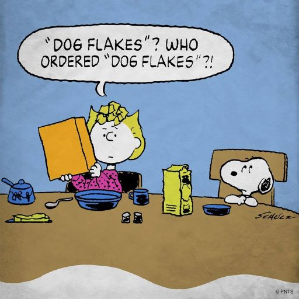

# Peanuts Data Project

### 1. Objective
このプロジェクトは、朝ごはんが成績とどのような関係を持っているかを、Peanutsの登場キャラクターのデータを用いて分析する。
- 好物であるパンケーキを朝ごはんに食べることは、よい成績と相関があるか
- アレルギーのもとになる"dog flake"を朝ごはんに食べることは、悪い成績と関連しているか

 

### 2. Outputs
このプロジェクトの分析結果は、この[報告書](https://raw.githubusercontent.com/Chishio318/Peanuts-Data-Project/master/05_report/draft/pdf/Peanuts_Data_Project.pdf)に説明されている。

### 3. Inputs
このプロジェクトは、以下の３つのデータセットを用いている。
- [breakfast](https://github.com/Chishio318/Peanuts-Data-Project/tree/master/02_raw/breakfast/docs/readme.md)
- [test scores](https://github.com/Chishio318/Peanuts-Data-Project/tree/master/02_raw/test_score/docs/readme.md)
- [student ID](https://github.com/Chishio318/Peanuts-Data-Project/tree/master/02_raw/student_id/docs/readme.md)

### 4. Process
全体を統合する``R script``は、[master](https://github.com/Chishio318/Peanuts-Data-Project/blob/master/01_admin/00_master)フォルダーの``admin.R``に整理されている。こちらを実行することで、データ分析を再現できる。

### 5. Details
[``Wiki``](https://github.com/Chishio318/Peanuts-Data-Project/wiki)にプログラムのステップを説明してある。
- [Overleaf](https://www.overleaf.com/read/sybhtxktnrhj)のページから、文書を確認できる。

### 6. Dependencies
このプログラムは、外部プログラムなどに依存せずに実行することができる。
